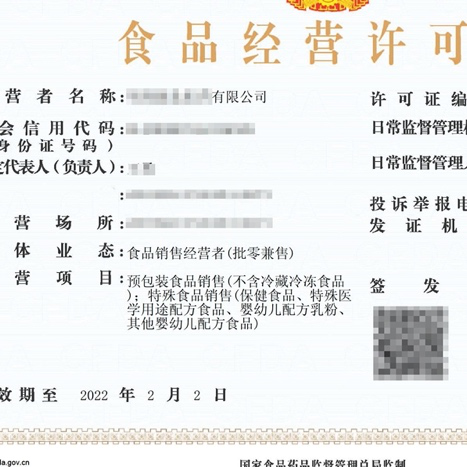
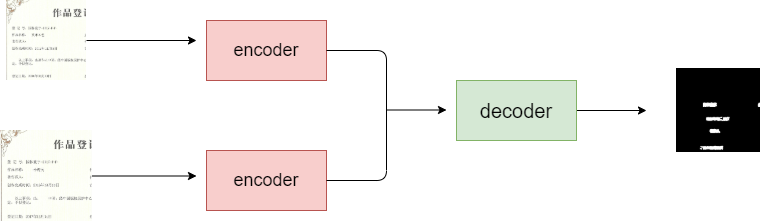

# Original image-assisted tamper detection（OIA-TD）
We propose an original image-assisted tamper detection method named OIA-TD which rank 2 among  1471 teams in [Analyticup: Falsified image tampering detection-track 2](https://tianchi.aliyun.com/competition/entrance/531812/rankingList)
#### Code will be available soon.

* * *

### dataset structure
We use the primary tampered image as auxiliary information and the secondary tampered image at the same time as input to the model.

* primary tampered image

* secondary tampered image

* * *
### model structure

We propose a model based encoder-decoder structure.

